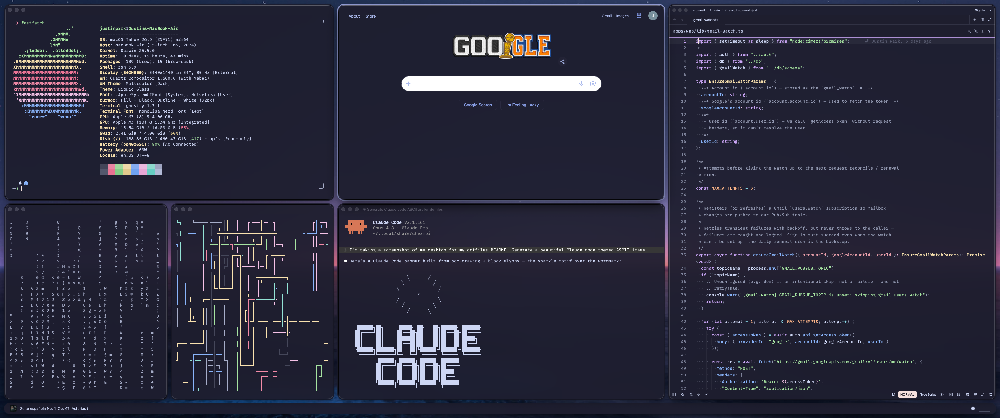
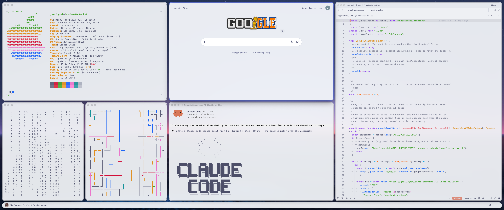
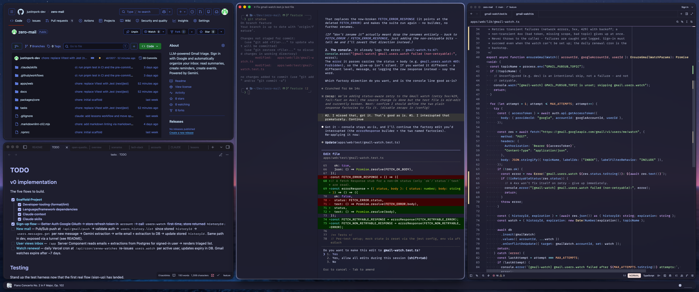
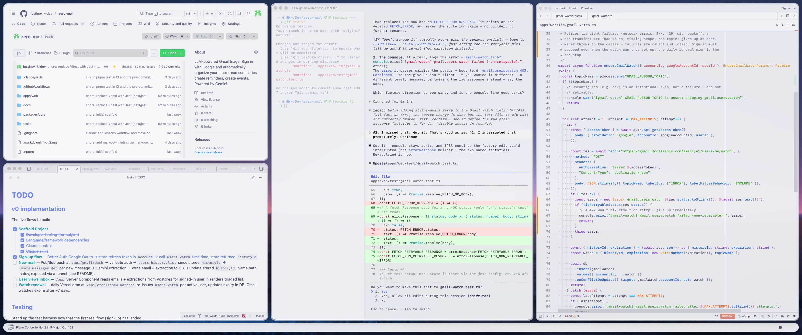

# dotfiles

_Intended for personal use. macOS dotfiles managed by [`chezmoi`](https://www.chezmoi.io/)._

## Dashboard

| Format, Lint                                                                                                                                                                            | Deploy Public (macOS)                                                                                                                                                                                            | Deploy Authenticated (macOS)                                                                                                                                                                                                          | Zsh Benchmark Startup                                                                                                                                                                                                |
| --------------------------------------------------------------------------------------------------------------------------------------------------------------------------------------- | ---------------------------------------------------------------------------------------------------------------------------------------------------------------------------------------------------------------- | ------------------------------------------------------------------------------------------------------------------------------------------------------------------------------------------------------------------------------------- | -------------------------------------------------------------------------------------------------------------------------------------------------------------------------------------------------------------------- |
| [](https://github.com/justinpxrk-dev/dotfiles/actions/workflows/format-lint.yml) | [](https://github.com/justinpxrk-dev/dotfiles/actions/workflows/deploy-public-macos.yml) | [](https://github.com/justinpxrk-dev/dotfiles/actions/workflows/deploy-authenticated-macos.yml) | [](https://github.com/justinpxrk-dev/dotfiles/actions/workflows/zsh-benchmark-startup.yml) |

## Showcase

### Desktop

<table width="100%">
	<tr>
		<th align="left" width="50%">Dark (<a href="https://catppuccin.com">Catppuccin Mocha</a>)</th>
		<th align="left" width="50%">Light (<a href="https://catppuccin.com">Catppuccin Latte</a>)</th>
	</tr>
	<tr>
		<td align="center" width="50%"></td>
		<td align="center" width="50%"></td>
	</tr>
</table>

### Development

<table width="100%">
	<tr>
		<th align="left" width="50%">Dark (<a href="https://catppuccin.com">Catppuccin Mocha</a>)</th>
		<th align="left" width="50%">Light (<a href="https://catppuccin.com">Catppuccin Latte</a>)</th>
	</tr>
	<tr>
		<td align="center" width="50%"></td>
		<td align="center" width="50%"></td>
	</tr>
</table>

## Bootstrap

On a new machine, install `chezmoi` and apply the dotfiles in one step:

```sh
sh -c "$(curl -fsLS get.chezmoi.io)" -- init --apply justinpxrk-dev
```

Or if `chezmoi` is already installed:

```sh
chezmoi init --apply justinpxrk-dev/dotfiles
```

`chezmoi` automatically runs bootstrap scripts on first apply (submodules, LaunchAgent registration). Install developer environment and run setup scripts from the repo:

```sh
mise trust                     # trust config file (mise.toml)
mise install                   # install configured tools
mise macos:set-system-settings # apply macOS defaults (reboot after)
```

To theme Spotify, run Spicetify's one-time backup; the Catppuccin theme is then applied by the `spicetify:handle-theme-change` task (and automatically on every light/dark switch):

```sh
spicetify backup apply                 # one-time, lets Spicetify patch Spotify
mise run spicetify:handle-theme-change # apply Catppuccin for the current mode
```

## Update

From the repo, `git pull` or from anywhere:

```sh
chezmoi update
```

## Structure

Entries prefixed with `dot_` or `empty_`, and `Library/LaunchAgents/`, are applied by `chezmoi`; all other directories are tracked in git only.

```text
chezmoi/                                — repo root (~/.local/share/chezmoi)
├── .agents/                            — shared agent instructions and skills
│   └── skills/                         — commit and merge skills
├── .chezmoiscripts/                    — bootstrap scripts run automatically by chezmoi on apply
├── .claude/                            — Claude Code config and skills
│   └── skills/                         — custom slash commands
├── .codex/                             — Codex config and skills
│   └── skills/                         — wrappers around shared skills
├── .github/                            — GitHub metadata
│   └── workflows/                      — GitHub Actions workflows
├── assets/                             — icons and images
├── Library/                            → ~/Library/ - macOS Library files
│   ├── Fonts/                          — font sources (git-only)
│   │   ├── font-monolisa @ †           — MonoLisa font source (private)
│   │   └── lib/                        — font tooling
│   │       └── monolisa-nerdfont-patch @ † — Nerd Font patcher (private)
│   ├── LaunchAgents/                   — launchd service definitions
│   ├── Themes/                         — theme definitions (git-only)
│   │   ├── Catppuccin/                 — Catppuccin theme ports
│   │   │   ├── delta @                 — git-delta diff theme
│   │   │   ├── ghostty @               — Ghostty terminal theme
│   │   │   └── spicetify @ ⑂           — Spotify theme templates
│   │   ├── Petrichor/                  — Base24 palette definitions
│   │   └── tinted/                     — tinted-builder template upstreams
│   │       ├── tinted-shell @ ⑂        — shell theme templates
│   │       ├── tinted-terminal @ ⑂     — terminal theme templates
│   │       └── tinted-vscode @ ⑂       — VSCode theme templates
│   ├── Unmanaged/                      — reference configs not managed by chezmoi (git-only)
│   └── Wallpapers/                     — desktop wallpapers (git-only)
├── scripts/                            — shell scripts (run via mise tasks)
├── docs/                               — documentation
├── dot_Brewfile                        → ~/.Brewfile - Homebrew bundle
├── dot_claude/                         → ~/.claude - Claude Code user config
├── dot_config/                         → ~/.config/ - XDG config root
│   ├── borders/                        — JankyBorders config
│   ├── chezmoi/                        — chezmoi config
│   ├── delta/                          — git-delta theme symlink (→ Library/Themes/Catppuccin/delta)
│   ├── ghostty/                        — Ghostty terminal config
│   ├── git/                            — Git config
│   ├── nvim/                           — Neovim config
│   ├── sketchybar/                     — SketchyBar config
│   │   └── lib/                        — SketchyBar libraries
│   │       ├── sketchybar-app-font @   — app icon font
│   │       └── SbarLua @               — SketchyBar Lua bindings
│   ├── skhd/                           — skhd hotkey daemon config
│   ├── spicetify/                      — Spicetify (Spotify) config
│   ├── yabai/                          — yabai window manager config
│   ├── zed/                            — Zed editor config
│   └── zsh/                            — Zsh interactive shell config
├── dot_zshenv.tmpl                     → ~/.zshenv - Zsh environment (all shells)
└── empty_dot_hushlogin                 → ~/.hushlogin - suppress login banner
```

`@` submodule · `⑂` fork · `†` private
