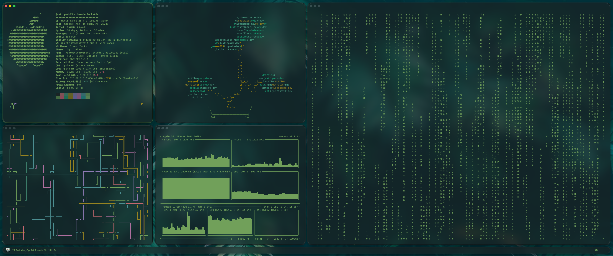
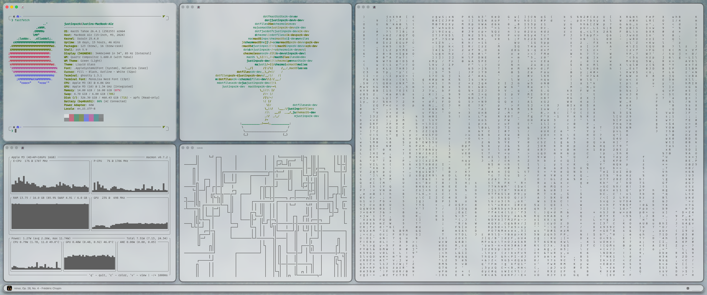

# dotfiles

macOS dotfiles managed by chezmoi.

## Theme

[**Petrichor**](Themes/Petrichor/petrichor-dark.yml) (generated by `Scripts/Themes/generate_base24_palette.py`)

<table width="100%">
	<tr>
		<th align="left">Terminal (Dark)</th>
	</tr>
	<tr>
		<td align="center"></td>
	</tr>
	<tr>
		<th align="left">Terminal (Light)</th>
	</tr>
	<tr>
		<td align="center"></td>
	</tr>
</table>

## Bootstrap

On a new machine, install chezmoi and apply the dotfiles in one step:

```sh
sh -c "$(curl -fsLS get.chezmoi.io)" -- init --apply justinpxrk-dev/dotfiles
```

Or if chezmoi is already installed:

```sh
chezmoi init --apply justinpxrk-dev/dotfiles
```

Then run the following from the repo root (`~/.local/share/chezmoi`):

```sh
./Scripts/git/install_submodules.sh       # build fonts, SbarLua, sketchybar-app-font
./Scripts/cargo/install_tools.sh          # install tinted-builder-rust
./Scripts/macos/register_launch_agents.sh # load LaunchAgents into login session
./Scripts/macos/set_system_settings.sh    # apply macOS defaults (reboot after)
```

