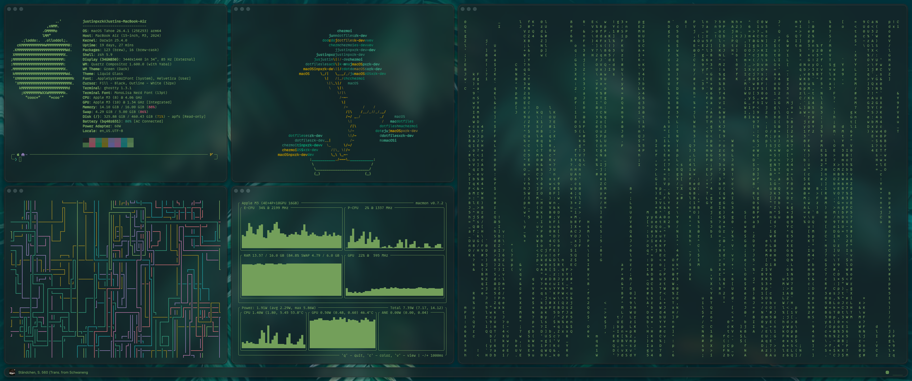
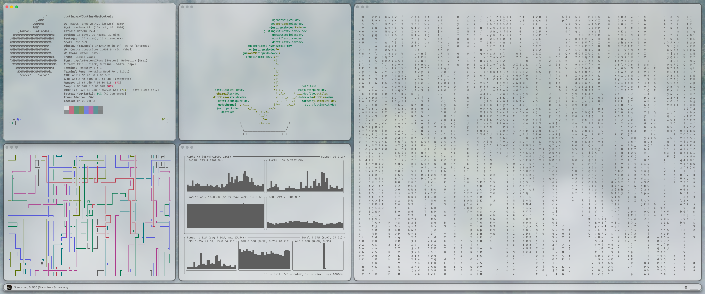

# dotfiles

_Intended for personal use (some listed features may be under development). Inspect all code and use at your own risk._

macOS (Tahoe 26.4.1) dotfiles managed by [`chezmoi`](https://www.chezmoi.io/).

A macOS-centric developer setup for a software engineer focused on agentic coding. Designed for frictionless portability, productivity, and neat integration with the macOS design system. Featuring [Tinted Theming](https://github.com/tinted-theming) integration with a custom luminance-balancing color generation script for automatic dark/light mode theme changes, shell startup times under 40 ms (on Apple M3), tiling window management from [`yabai`](https://github.com/asmvik/yabai) (SIP-enabled mode for workplace compatibility), [`sketchybar`](https://github.com/felixkratz/sketchybar) config written in Lua, and more!

## Theme

[**Petrichor**](docs/architecture/Themes/theme-system.md) (generated by [`generate_base24_palette.py`](Scripts/Themes/generate_base24_palette.py))

<table width="100%">
	<tr>
		<th align="left">Terminal (<a href="Themes/Petrichor/petrichor-dark.yml">Petrichor Dark</a>)</th>
	</tr>
	<tr>
		<td align="center"></td>
	</tr>
	<tr>
		<th align="left">Terminal (<a href="Themes/Petrichor/petrichor-light.yml">Petrichor Light</a>)</th>
	</tr>
	<tr>
		<td align="center"></td>
	</tr>
</table>

## Features

- **[Tinted Theming](https://github.com/tinted-theming) Ecosystem**. Download and build themes with simple commands using templates for any application supported by the [Tinted Theming](https://github.com/tinted-theming) community. Availables themes listed in [Tinted Gallery](https://tinted-theming.github.io/tinted-gallery/).
- **Dark/Light Mode.** Integration with macOS system notifications for dark/light mode theme changes for all your applications.
- **[Ghostty](https://ghostty.org/).** [Alacritty](https://alacritty.org/) is the hands down fastest terminal but **[Ghostty](https://ghostty.org/)** is nearly as fast and uses the macOS native window native rendering pipeline for a system-cohesive look.
- **Fast `zsh` Startup.** Highly optimized and feature-rich ([`powerlevel10k`](https://github.com/romkatv/powerlevel10k) prompt, syntax highlighting, suggestions, etc.) `zsh` config that starts up between 30 and 40 ms (on Apple M3) (warm benchmark on 200 runs), <20 ms on `source`, ~40 ms on new terminal startup.
- **Tiling Window Management**. [`yabai`](https://github.com/asmvik/yabai) + [`skhd`](https://github.com/asmvik/skhd) for keyboard-driven window layout management.
- **Customizable Menu Bar**. [`sketchybar`](https://github.com/felixkratz/sketchybar)config written in Lua to implement a performant, extendable event-driven architecture.
- **Developer Tool Management.** [`mise`](https://mise.jdx.dev/) for managing all developer tools and automatic environment activation.
- **Package Management.** Homebrew formulae and casks tracked in `Brewfile` and auto-installed on `chezmoi apply`.
- **Coding Agent Knowledge Base.** Use any agent with the agent-agnostic knowledge base under `docs/` to support dotfiles management and custom feature development.

## Bootstrap

On a new machine, install `chezmoi` and apply the dotfiles in one step:

```sh
sh -c "$(curl -fsLS get.chezmoi.io)" -- init --apply justinpxrk-dev
```

Or if `chezmoi` is already installed:

```sh
chezmoi init --apply justinpxrk-dev/dotfiles
```

`chezmoi init` clones this repo to `~/.local/share/chezmoi` (the default source directory on macOS).

`chezmoi` automatically runs bootstrap scripts on first apply (submodules, cargo tools, LaunchAgent registration). Afterwards, apply macOS system defaults and reboot:

```sh
./Scripts/macos/set_system_settings.sh    # apply macOS defaults (reboot after)
```

## Update Dotfiles

```
chezmoi update
```

## Project Structure

Entries prefixed with `dot_` or `empty_`, and `Library/`, are applied by `chezmoi`; all other directories are tracked in git only.

```
chezmoi/
├── .chezmoiscripts/ — bootstrap scripts run automatically by chezmoi
├── docs/       — documentation
├── dot_Brewfile → ~/.Brewfile
├── dot_claude/ → ~/.claude
├── dot_config/ → ~/.config/
│   ├── borders/
│   ├── ghostty/
│   ├── git/
│   ├── nvim/
│   ├── sketchybar/
│   │   └── lib/
│   │       ├── sketchybar-app-font @
│   │       └── SbarLua @
│   ├── skhd/
│   ├── spicetify/
│   ├── yabai/
│   └── zsh/
├── dot_zshenv  → ~/.zshenv
├── empty_dot_hushlogin → ~/.hushlogin
├── Assets/     — icons and images
├── Fonts/      — font sources
│   ├── font-monolisa @ †
│   └── lib/
│       └── monolisa-nerdfont-patch @ †
├── Library/    → ~/Library/
│   └── LaunchAgents/
├── Scripts/    — shell scripts
├── Themes/     — Petrichor theme definitions (see Themes System)
│   └── lib/
│       ├── tinted-terminal @ ⑂
│       └── tinted-vscode @ ⑂
├── Unmanaged/  — reference configs not managed by chezmoi
└── Wallpapers/ — desktop wallpapers
```

`@` submodule · `⑂` fork · `†` private
